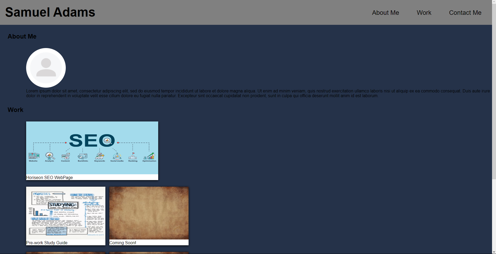

# Portfolio

## Description

I built this project so I could have a professional place to store and present my projects to colleagues and employers. I learned a lot more about CSS, especially the flex-box. This portfolio truly helped me learn which CSS properties I enjoy the most.

## Installation

N/A

## Usage

https://sadums.github.io/Portfolio/

## License

Refer to the repository